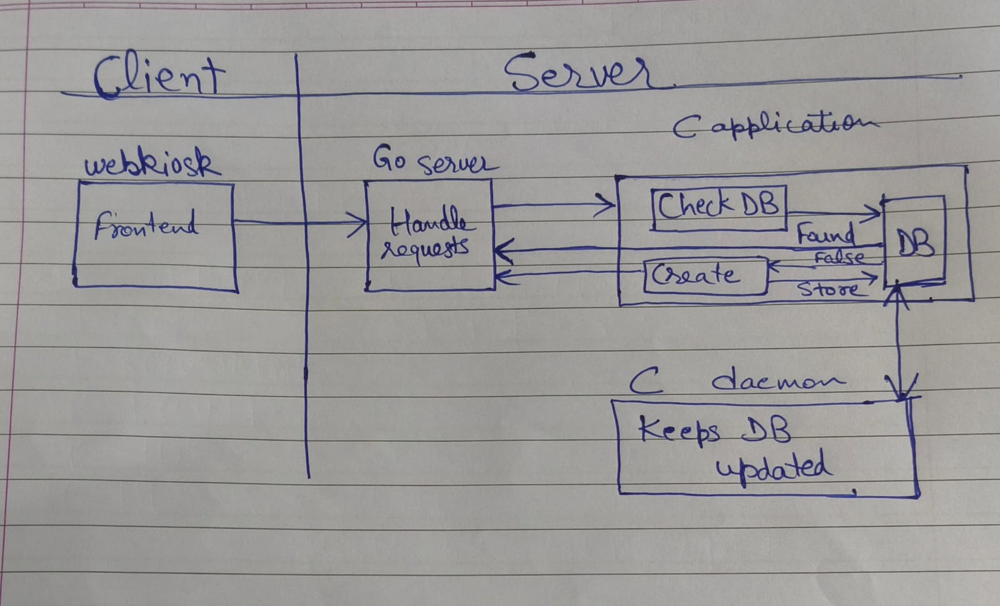

# Webkiosk Cached

## Architecture Imagined


## Project Status
- [v] Basic Curl and dotenv Setup Completed
- [v] Connect DB and fetch username password from DB and store responses in DB
```
Due to memory allocation issues the data is not tunnelling properly between function.
The username for example went wrong from fetch_data function in fetch_data.c to store_html_response function in db.c

The mongo cursor was being destroyed hence username and password would become dangling in main when sent out of scope to fetch_data.c. 
Current solution implements a copy of username and password to preserve scope.
```
- Correct memory garbage value issues
- Add logic of fetching and returning mongo data otherwise creating data and sending appropriate responses
- Test using command line arguments like pass roll number and password, store cookie in db, select service and dislpay html response using cookie from db.
- Make application as a service so other applications can communicate with this one
- Setup Go Backend for test purpose
- Test(1) - Pass Credentials and show HomePage
- Test(2) - Show Student Info Page
- Setup Frontend Service in a dummy manner to test working
- Connect APIs
- Setup Auth and use JWT tokens to maintain sessions
- Make deamon service to keep on updating the webkiosk data in DB

## Build Process
- Make a .env file with params 
```
MONGO_URI=<connection string>
```
- make ```test``` database with collections ```signin``` and ```html_responses```
- Run ``` make ``` command and then ```./main```


when getMOngo cred is called it verifys the creds stores the jsession cookie and updates accordingly (all done) (even if the original password is changed it checks for that)!
when fetch_data is called it updates all the html pages for the user that can be used by the go/django server directly for client (incomplete)
store_html_response should first find the user entry then update the the pages one by one based on names (exam marks,viewsgpa cgpa,etc)
